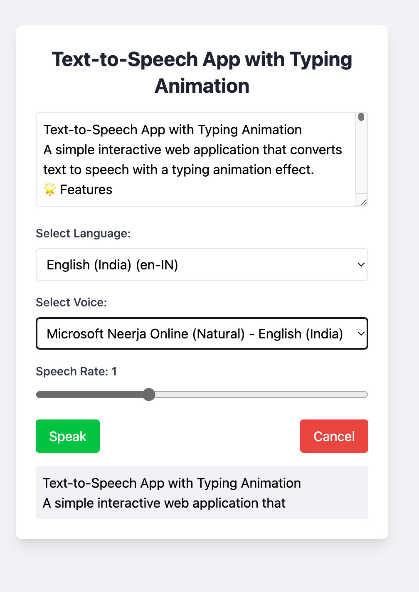

# Text-to-Speech App with Typing Animation

A simple interactive web application that converts text to speech with a typing animation effect.

## 📺 Demo

<video width="360" height="640" controls style="max-width: 100%; height: auto;">
  <source src="./demo.mp4" type="video/mp4">
  Your browser does not support the video tag.
</video>

## 🌟 Features

-   **Multi-language Support**: Choose from a variety of languages for text-to-speech conversion.
-   **Voice Selection**: Pick from multiple voices available for each language.
-   **Adjustable Speech Rate**: Customize the speed of speech output.
-   **Real-time Typing Animation**: Watch as the spoken text appears on screen with a typewriter-like effect.
-   **Responsive Design**: Beautifully crafted UI that works seamlessly on both desktop and mobile devices.

## 🚀 Quick Start

1. Open the `index.html` file in a modern web browser.
2. Enter the text you want to convert to speech in the textarea.
3. Select your preferred language and voice.
4. Adjust the speech rate if desired.
5. Click the "Speak" button to start the text-to-speech conversion with typing animation.

## 🛠️ Technologies Used

-   HTML5
-   CSS3 (with Tailwind CSS for styling)
-   JavaScript (ES6+)
-   Web Speech API

## 🎨 User Interface

The app features a clean, intuitive interface with the following components:

-   Text input area
-   Language selection dropdown
-   Voice selection dropdown
-   Speech rate slider
-   Speak and Cancel buttons
-   Output display area for the typing animation

## 🔧 Key Components

1. **Language and Voice Selection**:

    - Dynamically populates available languages and voices.
    - Updates voice options based on the selected language.

2. **Speech Synthesis**:

    - Utilizes the Web Speech API for text-to-speech conversion.
    - Supports cancellation of ongoing speech.

3. **Typing Animation**:

    - Implements a word-by-word typing effect synchronized with speech.
    - Uses `Intl.Segmenter` for accurate word segmentation across languages.

4. **Responsive Design**:
    - Employs Tailwind CSS for a mobile-friendly layout.

## 🌐 Browser Compatibility

This app works best on modern browsers that support the Web Speech API and ES6+ features. For optimal performance, use the latest versions of Chrome, Firefox, Safari, or Edge.
